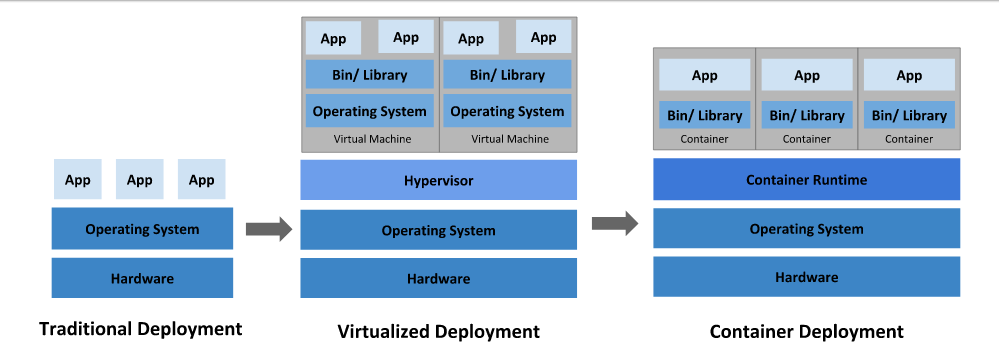

<center><font face="黑体" size="6">数据通信与计算机网络课后实践</font>


<center>
    <font face="楷体" size="5">小组成员：</font>
</center>

<center>
    <font face="楷体" size="5">3190104783 欧翌昕</font>
</center>

<center>
    <font face="楷体" size="5">3190104506 杨子晗</font>
</center>
<center>
    <font face="楷体" size="5">3190106158 潘妘</font>
</center>

<center>
    <font face="楷体" size="5">3190102305 赵紫宸</font>
</center>


<center>
    <font face="楷体" size="5">课程名称：数据通信与计算机网络</font>
</center>
<center>
    <font face="楷体" size="5">指导老师：胡骏</font>
</center>
 


<center>
    </font><font face="黑体" size="5">2020~2021春夏学期 2021 年 4 月 18 日</font>
</center>

# 1  基础组网

## 1.1 实验环境

GNS3 是一款具有图形化界面的、可以运行在多平台（包括Windows, Linux, and MacOS等）的网络虚拟仿真软件。通过 Cisco 官方提供的路由器和交换机的镜像文件，GNS3 能够完整地模拟整个校园网络或企业网络。GNS3 由多个组件集合而成，包含了 Dynamips、Qemu、Wireshark 等程序。Dynamips 是一个基于虚拟化技术的模拟器（emulator），本身就能够模拟路由器和交换机。GNS3 在 Dynamips 的基础上，加入一个友好的图形化操作界面 Qemu，目前 GNS3 可以模拟防火墙、入侵检测系统、Juniper 路由器等；Wireshark 组件用于进行数据报文分析。

本部分实验使用一台操作系统为 Ubuntu 20.04.2 LTS x86_64 的个人计算机，通过版本为2.2.19的 GNS3 网络虚拟仿真软件完成。

本部分实验路由器采用的镜像为 c7200-a3jk9s-mz.124-25g，路由交换机采用的镜像为 c3640-a3js-mz.124-25d，交换机采用的镜像为 c3640-a3js-mz.124-25d，所有实验操作和命令都以此为基础。


## 1.2 虚拟网络组网

### 1.2.1 实验原理

#### 虚拟局域网

虚拟局域网(Virtual Local Area Network 或简写 VLAN)是一种建构于局域网交换技术(LAN Switch)的网络管理的技术，网管人员可以借此透过控制交换机有效分派出入局域网的分组到正确的出入端口，达到对不同实体局域网中的设备进行逻辑分群管理，并降低局域网内大量资料流通时，因无用分组过多导致拥塞的问题，以及提升局域网的信息安全保障。 

#### 三层交换机

三层交换机就是具有部分路由器功能的交换机，三层交换机的最重要目的是加快大型局域网内部的数据交换，所具有的路由功能也是为这目的服务的，能够做到一次路由，多次转发。对于数据包转发等规律性的过程由硬件高速实现，而像路由信息更新、路由表维护、路由计算、路由确定等功能，由软件实现。三层交换技术就是二层交换技术 +三层转发技术。传统交换技术是在 OSI网络标准模型第二层数据链路层进行操作的，而三层交换技术是在网络模型中的第三层实现了数据包的高速转发，既可实现网络路由功能，又可根据不同网络状况做到最优网络性能。

局域网按功能或地域等因素划成一个个小的局域网，这就使 VLAN 技术在网络中得以大量应用，而各个不同 VLAN 间的通信都要经过路由器来完成转发，随着网间互访的不断增加。单纯使用路由器来实现网间访问，不但由于端口数量有限，而且路由速度较慢，从而限制了网络的规模和访问速度。基于这种情况三层交换机便应运而生，三层交换机是为 IP 设计的，接口类型简单，拥有很强二层包处理能力，非常适用于大型局域网内的数据路由与交换，它既可以工作在协议第三层替代或部分完成传统路由器的功能，同时又具有几乎第二层交换的速度，且价格相对便宜些。

例如模型：使用IP的设备 A←→三层交换机←→使用 IP 的设备 B。

比如 A 要给 B 发送数据，已知目的 IP，那么 A 就用子网掩码取得网络地址，判断目的 IP 是否与自己在同一网段。如果在同一网段，但不知道转发数据所需的 MAC 地址，A 就发送一个 ARP 请求，B 返回其 MAC 地址，A 用此 MAC 封装数据包并发送给交换机，交换机起用二层交换模块，查找 MAC 地址表，将数据包转发到相应的端口。

如果目的 IP 地址显示不是同一网段的，那么 A要实现和 B的通讯，在流缓存条目中没有对应 MAC 地址条目，就将第一个正常数据包发送向一个缺省网关，这个缺省网关一般在操作系统中已经设好，对应第三层路由模块，所以可见对于不是同一子网的数据，最先在  MAC 表中放的是缺省网关的 MAC 地址；然后就由三层模块接收到此数据包，查询路由表以确定到达 B 的路由，将构造一个新的帧头，其中以缺省网关的 MAC 地址为源 MAC 地址，以主机 B 的 MAC 地址为目的 MAC 地址。通过一定的识别触发机制，确立主机 A 与 B 的 MAC 地址及转发端口的对应关系，并记录进流缓存条目表，以后的 A 到 B 的数据，就直接交由二层交换模块完成。这就通常所说的一次路由多次转发。

表面上看，第三层交换机是第二层交换器与路由器的合二为一，然而这种结合并非简单的物理结合，而是各取所长的逻辑结合。其重要表现是，当某一信息源的第一个数据流进行第三层交换后，其中的路由系统将会产生一个 MAC 地址与 IP 地址的映射表，并将该表存储起来，当同一信息源的后续数据流再次进入交换环境时，交换机将根据第一次产生并保存的地址映射表，直接从第二层由源地址传输到目的地址，不再经过第三路由系统处理，从而消除了路由选择时造成的网络延迟，提高了数据包的转发效率，解决了网间传输信息时路由产生的速率瓶颈。所以说，第三层交换机既可完成第二层交换机的端口交换功能，又可完成部分路由器的路由功能。

#### 交换机虚拟接口

交换机虚拟接口（Switch Virtual Interface，简称SVI），多用于路由交换机（三层），是一种三层逻辑接口，其实就是指通常所说的VLAN接口，只不过它是虚拟的，用于连接整个VLAN，所以通常也把这种接口称为逻辑三层接口。

一个 SVI 接口对应一个 VLAN， 一个 VLAN 仅可以有一个 SVI。当需要在 VLAN 之间进行路由通信，或者提供 IP 主机到交换机的连接的时候，就需要起用交换机上相关 VLAN 的 SVI 接口，即为相关 VLAN 的 SVI 接口配置 IP 地址、子网掩码，因此，SVI 是联系 VLAN 的 IP 接口。

### 1.2.2 实验内容及其步骤

#### 网络规划与设计

此步骤中的局域网由1台路由交换机（R1）、2台交换机（SW1 和 SW2）与6台 PC 机（Host1~Host6）组成，网络拓扑结构如下图所示。


PC 机 IP 地址设计如下表所示。

| 设备  |    IP 地址    |   子网掩码    |     网关     |
| :---: | :-----------: | :-----------: | :----------: |
| Host1 | 10.0.101.1/24 | 255.255.255.0 | 10.0.101.254 |
| Host2 | 10.0.101.2/24 | 255.255.255.0 | 10.0.101.254 |
| Host3 | 10.0.102.3/24 | 255.255.255.0 | 10.0.102.254 |
| Host4 | 10.0.101.4/24 | 255.255.255.0 | 10.0.101.254 |
| Host5 | 10.0.101.5/24 | 255.255.255.0 | 10.0.101.254 |
| Host6 | 10.0.102.6/24 | 255.255.255.0 | 10.0.102.254 |

路由器端口 IP 设计如下表所示。

| 设备 |     IP 地址     |            说明            |
| :--: | :-------------: | :------------------------: |
|  R1  | 10.0.101.254/24 | 配置给虚拟交换接口 VLAN 10 |
|  R1  | 10.0.102.254/24 | 配置给虚拟交换接口 VLAN 20 |

交换机 VLAN 划分设计如下表所示。

| 设备 | 端口 | VLAN ID | VLAN Name |  端口性质   |
| :--: | :--: | :-----: | :-------: | :---------: |
| SW1  | F0/0 |    /    |     /     | Trunk Port  |
| SW1  | F0/1 | VLAN 10 | VLAN0010  | access Port |
| SW1  | F0/2 | VLAN 10 | VLAN0010  | access Port |
| SW1  | F0/3 | VLAN 20 | VLAN0020  | access Port |
| SW2  | F0/0 |    /    |     /     | Trunk Port  |
| SW2  | F0/1 | VLAN 10 | VLAN0020  | access Port |
| SW2  | F0/2 | VLAN 10 | VLAN0020  | access Port |
| SW2  | F0/3 | VLAN 20 | VLAN0020  | access Port |
|  R1  | F0/1 |    /    |     /     | Trunk Port  |
|  R1  | F0/2 |    /    |     /     | Trunk Port  |

#### 部署网络并配置 PC 机 IP 地址

在 GNS3 中部署网络设备，此步骤中的路由交换机使用c3600路由器来模拟，使用时通过”ip routing”命令开启三层路由功能。二层交换机使用c3600路由器来模拟，使用时通过”no ip routing”命令关闭路由功能。主机采用 GNS3 中自带的 VPCS 虚拟主机实现。 

按照前述网络拓扑设计，完成各个网络设备的部署、网线的连接，并启动整个网络。

整个网络在 GNS3 中的拓扑结构以及接口连接如下图所示。


打开 Host1 的命令控制台窗口，配置并保存 IP 地址(10.0.101.1/24)、子网掩码(255.255.255.0)和默认网关(10.0.101.254)地址，配置命令如下。

```
ip 10.0.101.1/24 255.255.255.0 10.0.101.254
save
```


同理，按照前述 IP 地址设计，配置并保存 Host2~Host6 的 IP 地址、子网掩码、默认网关。

#### 对二层交换机 SW1 进行配置并测试网络连通性

开启交换机 SW1，打开 SW1 的命令控制台窗口，按照规划在交换机 SW1 上配置 VLAN，并将相关端口设置成 access 端口或 trunk 端口。 配置命令如下所示 。

```
vlan database
vlan 10
vlan 20
exit

config terminal
interface f0/1
switchport mode access
switchport access vlan 10
exit

interface f0/2
switchport mode access
switchport access vlan 10
exit

interface f0/3
switchport mode access
switchport access vlan 20
exit

exit
```

此时查看该交换机 vlan 的简要情况如下。


```
config terminal
interface f0/0
switchport trunk encapsulation dot1q
switchport mode trunk
exit
exit
```

查看交换机上 trunk 端口的信息如下。


使用`ping`命令，测试各 PC 之间的连通性，通信结果如下表所示。

| 序号 | 请求主机 | 响应主机 |          `ping`测试结果           |
| :--: | :------: | :------: | :-------------------------------: |
|  1   |  Host1   |  Host2   |              success              |
|  2   |  Host1   |  Host3   | host (10.0.101.254) not reachable |
|  3   |  Host1   |  Host4   |  host (10.0.101.4) not reachable  |
|  4   |  Host1   |  Host5   |  host (10.0.101.5) not reachable  |
|  5   |  Host1   |  Host6   | host (10.0.101.254) not reachable |

分析

#### 对二层交换机 SW2 进行配置并测试网络连通性

开启交换机 SW2，打开 SW2 的命令控制台窗口，按照规划在交换机 SW2 上配置 VLAN，并将相关端口设置成 access 端口或 trunk 端口。 配置过程同 SW1。

配置完成后分别查看交换机 vlan 的简要情况和交换机上 trunk 端口的信息如下。


使用`ping`命令，测试各 PC 之间的连通性，通信结果如下表所示。

| 序号 | 请求主机 | 响应主机 |          `ping`测试结果           |
| :--: | :------: | :------: | :-------------------------------: |
|  1   |  Host1   |  Host2   |              success              |
|  2   |  Host1   |  Host3   | host (10.0.101.254) not reachable |
|  3   |  Host1   |  Host4   |  host (10.0.101.4) not reachable  |
|  4   |  Host1   |  Host5   |  host (10.0.101.5) not reachable  |
|  5   |  Host1   |  Host6   | host (10.0.101.254) not reachable |

分析

#### 在三层交换机 R1 中创建 VLAN、设置 trunk 接口并测试网络连通性

此步骤中，在三层交换机 R1上创建 VLAN10 和 VLAN20，但是不开启三层交换机 R1的路由功能（no ip routing），不起用交换机虚拟接口 SVI），只是根据网络拓扑的设计将三层交换机 R1上与二层交换机 SW1 和 SW2 相连的端口设置为 trunk 模式，然后测试跨交换机相同 VLAN 之间的通信和不同 VLAN之间的通信。

开启三层交换机 R1，打开其命令控制台窗口，配置命令如下所示 。

```
vlan database
vlan 10
vlan 20
exit

config termianl
interface range f0/1 -2
switchport trunk encapsulation dot1q
switchport mode trunk
exit

no ip routing
exit
```

查看交换机上的 trunk 端口如下。


使用`ping`命令，测试各 PC 之间的连通性，通信结果如下表所示。

| 序号 | 请求主机 | 响应主机 |          `ping`测试结果           |
| :--: | :------: | :------: | :-------------------------------: |
|  1   |  Host1   |  Host2   |              success              |
|  2   |  Host1   |  Host3   | host (10.0.101.254) not reachable |
|  3   |  Host1   |  Host4   |              success              |
|  4   |  Host1   |  Host5   |              success              |
|  5   |  Host1   |  Host6   | host (10.0.101.254) not reachable |

分析

#### 配置三层交换机 R1 的 SVI 接口、开启路由功能并测试网络连通性

此步骤中， 启用三层交换机 R1上 VLAN10 和 VLAN20的 SVI 接口，给他们配置 IP 地址。 开启三层交换机 R1的路由功能（ip routing），然后测试跨交换机相同 VLAN 之间的通信和不同 VLAN 之间的通信。

打开 R1 的命令控制台窗口，配置命令如下所示 。

```
config terminal
interface vlan 10
ip address 10.0.101.254 255.255.255.0
exit

interface vlan 20
ip address 10.0.102.254 255.255.255.0
exit

ip routing
exit
```

此时查看路由表信息如下。


使用`ping`命令，测试各 PC 之间的连通性，通信结果如下表所示。

| 序号 | 请求主机 | 响应主机 | `ping`测试结果 |
| :--: | :------: | :------: | :------------: |
|  1   |  Host1   |  Host2   |    success     |
|  2   |  Host1   |  Host3   |    success     |
|  3   |  Host1   |  Host4   |    success     |
|  4   |  Host1   |  Host5   |    success     |
|  5   |  Host1   |  Host6   |    success     |

分析


## 1.3 路由配置

### 1.3.1 实验原理

路由器是互联网的主要节点设备。路由器通过路由表决定数据的转发。转发策略称为路由选择（routing），这也是路由器名称的由来 router，转发者）。作为不同网络之间互相连接的枢纽，路由器系统构成了基于 TCP/IP 的国际互联网络 Internet 的主体脉络，也可以说，路由器构成了 Internet 的骨架。在局域网中，为了实现不同网络之间的互联，仍然需要路由器，路由器是用来连接不同网段或网络的。

在一个局域网中，如果不需与外界网络进行通信的话，内部网络的各主机都能识别其它主机 ，通过交换机就可以实现目的发送，根本用不上路由器来记忆局域网的各主机的 MAC 地址。

路由器的主要作用是识别不同网络 ，然后进行转发。路由器识别不同网络的方法是通过识别不同网络的网络 ID 号进行的，所以为了保证路由转发成功，每个网络都必须有一个唯一的网络编号。路由器要识别另一个网络，首先要识别的就是对方网络的路由器 IP 地址的网络 ID，看是不是与目的 主机 地址中的网络 ID 号相一致。如果是就向这个网络的路由器发送，接收网络的路由器在接收到源 网络发来的报文后，根据报文中所包括的目的主机 IP 地址中的主机，ID 号来识别是发给哪一个 主机的，然后再直接发送。

静态路由是由网络规划者根据网络拓扑，使用命令在路由器上配置的路由信息。这些静态路由信息指导报文发送，静态路由方式也不需要路由器进行计算，它完全依赖于网络规划者，当网络规模较大或网络拓扑经常发生改变时，网络管理员需要做的工作将会非常复杂并
且容易产生错误。

### 1.3.2 实验内容及其步骤

#### 网络规划与设计

本实验使用了2台路由器（R1和 R2）、4台交换机（SW1~SW4）和8台 PC 机（Host1~Host8），网络拓扑结构如下图所示。


PC 机 IP 地址设计如下表所示。

| 设备  |   IP 地址    |   子网掩码    |    网关     |
| :---: | :----------: | :-----------: | :---------: |
| Host1 | 192.168.0.10 | 255.255.255.0 | 192.168.0.1 |
| Host2 | 192.168.0.20 | 255.255.255.0 | 192.168.0.1 |
| Host3 | 192.168.1.10 | 255.255.255.0 | 192.168.1.1 |
| Host4 | 192.168.1.20 | 255.255.255.0 | 192.168.1.1 |
| Host5 | 192.168.2.10 | 255.255.255.0 | 192.168.2.1 |
| Host6 | 192.168.2.20 | 255.255.255.0 | 192.168.2.1 |
| Host7 | 192.168.3.10 | 255.255.255.0 | 192.168.3.1 |
| Host8 | 192.168.3.20 | 255.255.255.0 | 192.168.3.1 |

路由器端口 IP 设计如下表所示。

| 设备 | 端口 |   IP 地址   |   子网掩码    |
| :--: | :--: | :---------: | :-----------: |
|  R1  | F0/0 |  10.0.0.1   | 255.255.255.0 |
|  R1  | F1/0 | 192.168.0.1 | 255.255.255.0 |
|  R1  | F1/1 | 192.168.1.1 | 255.255.255.0 |
|  R2  | F0/0 |  10.0.0.2   | 255.255.255.0 |
|  R2  | F1/0 | 192.168.2.1 | 255.255.255.0 |
|  R2  | F1/1 | 192.168.3.1 | 255.255.255.0 |

路由器 R1 和 R2 之间通过 F0/0 端口相连。路由器 R1 和 R2 的 F1/0 端口和  F1/1 端口的 IP 地址分别是其所连接网络的默认网关地址。

静态路由规划设计如下表所示。

| 所在设备 | 目的网络(目的网络号/子网掩码) |        下一跳地址         |
| :------: | :---------------------------: | :-----------------------: |
|    R1    | 192.168.2.0    255.255.255.0  | 10.0.0.2(R2 的 F0/0 接口) |
|    R1    | 192.168.3.0    255.255.255.0  | 10.0.0.2(R2 的 F0/0 接口) |
|    R2    | 192.168.0.0    255.255.255.0  | 10.0.0.1(R1 的 F0/0 接口) |
|    R2    | 192.168.1.0    255.255.255.0  | 10.0.0.1(R1 的 F0/0 接口) |

#### 部署网络并配置 PC 机 IP 地址

在 GNS3 中部署网络设备，此步骤中所用的路由器使用 c7200 路由器来模拟；所用的二层交换机使用 c3600 路由器来模拟(使用时通过“no ip routing”命令关闭路由功能)；所用的主机采用 GNS3 中自带的 VPCS 虚拟主机实现。

按照前述网络拓扑设计，完成各个网络设备的部署、网线的连接，并启动整个网络。

整个网络在 GNS3 中的拓扑结构以及接口连接如下图所示。


打开 Host1 的命令控制台窗口，配置并保存 IP 地址(192.168.0.10)、子网掩码(255.255.255.0)和默认网关(192.168.0.1)地址，配置命令如下。

```
ip 192.168.0.10 255.255.255.0 192.168.0.1
save
```


同理，按照前述 IP 地址设计，配置并保存 Host2~Host8 的 IP 地址、子网掩码、默认网关。

#### 配置路由器端口地址并测试连通性

此时路由器和交换机都是默认配置，使用`ping`命令，测试各 PC 之间的连通性，通信结果如下表所示。

| 序号 | 请求主机 | 响应主机 |          `ping`测试结果          |
| :--: | :------: | :------: | :------------------------------: |
|  1   |  Host1   |  Host2   |             success              |
|  2   |  Host1   |  Host3   | host (192.168.0.1) not reachable |
|  3   |  Host1   |  Host5   | host (192.168.0.1) not reachable |
|  4   |  Host1   |  Host7   | host (192.168.0.1) not reachable |
|  5   |  Host3   |  Host4   |             success              |
|  6   |  Host3   |  Host1   | host (192.168.1.1) not reachable |
|  7   |  Host3   |  Host5   | host (192.168.1.1) not reachable |
|  8   |  Host3   |  Host7   | host (192.168.1.1) not reachable |
|  9   |  Host5   |  Host6   |             success              |
|  10  |  Host5   |  Host1   | host (192.168.2.1) not reachable |
|  11  |  Host5   |  Host3   | host (192.168.2.1) not reachable |
|  12  |  Host5   |  Host7   | host (192.168.2.1) not reachable |
|  13  |  Host7   |  Host8   |             success              |
|  14  |  Host7   |  Host1   | host (192.168.3.1) not reachable |
|  15  |  Host7   |  Host3   | host (192.168.3.1) not reachable |
|  16  |  Host7   |  Host5   | host (192.168.3.1) not reachable |

根据网络规划与设计，配置路由器 R1 的接口 IP 地址。配置时要先进入路由器全局配置模式，然后再进入接口模式，方可给该接口配置 IP 地址，配置命令如下。

```
config terminal
interface fastethernet 0/0
ip address 10.0.0.1 255.255.255.0
no shutdown
exit

interface fastethernet 1/0
ip address 192.168.0.1 255.255.255.0
no shutdown
exit

interface fastethernet 1/1
ip address 192.168.1.1 255.255.255.0
no shutdown
exit

exit
write
```

查看路由器 R1 的路由表信息，结果如下。


同理配置路由器 R2 的接口地址，并查看路由表信息，结果如下。


再次使用`ping`命令，测试各 PC 之间的连通性，通信结果如下表所示。

| 序号 | 请求主机 | 响应主机  |        `ping`测试结果        |
| :--: | :------: | :-------: | :--------------------------: |
|  1   |  Host1   |   Host2   |           success            |
|  2   |  Host1   |   Host3   |           success            |
|  3   |  Host1   |   Host5   | Destination host unreachable |
|  4   |  Host1   |   Host7   | Destination host unreachable |
|  5   |  Host3   |   Host4   |           success            |
|  6   |  Host3   |   Host1   |           success            |
|  7   |  Host3   |   Host5   | Destination host unreachable |
|  8   |  Host3   |   Host7   | Destination host unreachable |
|  9   |  Host5   |   Host6   |           success            |
|  10  |  Host5   |   Host1   | Destination host unreachable |
|  11  |  Host5   |   Host3   | Destination host unreachable |
|  12  |  Host5   |   Host7   |           success            |
|  13  |  Host7   |   Host8   |           success            |
|  14  |  Host7   |   Host1   | Destination host unreachable |
|  15  |  Host7   |   Host3   | Destination host unreachable |
|  16  |  Host7   |   Host5   |           success            |
|  17  |  Host1   | R1 / F0/0 |           success            |
|  18  |  Host1   | R1 / F1/0 |           success            |
|  19  |  Host1   | R1 / F1/1 |           success            |
|  20  |  Host1   | R2 / F0/0 |           timeout            |
|  21  |  Host1   | R2 / F1/0 | Destination host unreachable |
|  22  |  Host1   | R2 / F1/1 | Destination host unreachable |
|  23  |  Host5   | R1 / F0/0 |           timeout            |
|  24  |  Host5   | R1 / F1/0 | Destination host unreachable |
|  25  |  Host5   | R1 / F1/1 | Destination host unreachable |
|  26  |  Host5   | R2 / F0/0 |           success            |
|  27  |  Host5   | R2 / F1/0 |           success            |
|  28  |  Host5   | R2 / F1/1 |           success            |

分析

#### 配置路由器 R1 的静态路由并测试连通性

在路由器 R1 中，添加到达 192.168.2.0/24 和 192.168.3.0/24 这两个网络的路由信息，配置命令如下。

```
config terminal
ip route 192.168.2.0 255.255.255.0 10.0.0.2
ip route 192.168.3.0 255.255.255.0 10.0.0.2
```

查看路由器 R1 的路由表信息，结果如下。


使用`ping`命令，测试各 PC 之间的连通性，通信结果如下表所示。

| 序号 | 请求主机 | 响应主机  |        `ping`测试结果        |
| :--: | :------: | :-------: | :--------------------------: |
|  1   |  Host1   |   Host2   |           success            |
|  2   |  Host1   |   Host3   |           success            |
|  3   |  Host1   |   Host5   |           timeout            |
|  4   |  Host1   |   Host7   |           timeout            |
|  5   |  Host3   |   Host4   |           success            |
|  6   |  Host3   |   Host1   |           success            |
|  7   |  Host3   |   Host5   |           timeout            |
|  8   |  Host3   |   Host7   |           timeout            |
|  9   |  Host5   |   Host6   |           success            |
|  10  |  Host5   |   Host1   | Destination host unreachable |
|  11  |  Host5   |   Host3   | Destination host unreachable |
|  12  |  Host5   |   Host7   |           success            |
|  13  |  Host7   |   Host8   |           success            |
|  14  |  Host7   |   Host1   | Destination host unreachable |
|  15  |  Host7   |   Host3   | Destination host unreachable |
|  16  |  Host7   |   Host5   |           success            |
|  17  |  Host1   | R1 / F0/0 |           success            |
|  18  |  Host1   | R1 / F1/0 |           success            |
|  19  |  Host1   | R1 / F1/1 |           success            |
|  20  |  Host1   | R2 / F0/0 |           timeout            |
|  21  |  Host1   | R2 / F1/0 |           timeout            |
|  22  |  Host1   | R2 / F1/1 |           timeout            |
|  23  |  Host5   | R1 / F0/0 |           success            |
|  24  |  Host5   | R1 / F1/0 | Destination host unreachable |
|  25  |  Host5   | R1 / F1/1 | Destination host unreachable |
|  26  |  Host5   | R2 / F0/0 |           success            |
|  27  |  Host5   | R2 / F1/0 |           success            |
|  28  |  Host5   | R2 / F1/1 |           success            |

#### 配置路由器 R2 的静态路由并测试连通性

参考路由器 R1 的静态路由配置，在路由器 R2 中，添加所需要的静态路由信息，配置命令如下。

```
config terminal
ip route 192.168.0.0 255.255.255.0 10.0.0.1
ip route 192.168.1.0 255.255.255.0 10.0.0.1
```

查看路由器 R2 的路由表信息，结果如下。


使用`ping`命令，测试各 PC 之间的连通性，通信结果如下表所示。

| 序号 | 请求主机 | 响应主机  | `ping`测试结果 |
| :--: | :------: | :-------: | :------------: |
|  1   |  Host1   |   Host2   |    success     |
|  2   |  Host1   |   Host3   |    success     |
|  3   |  Host1   |   Host5   |    success     |
|  4   |  Host1   |   Host7   |    success     |
|  5   |  Host3   |   Host4   |    success     |
|  6   |  Host3   |   Host1   |    success     |
|  7   |  Host3   |   Host5   |    success     |
|  8   |  Host3   |   Host7   |    success     |
|  9   |  Host5   |   Host6   |    success     |
|  10  |  Host5   |   Host1   |    success     |
|  11  |  Host5   |   Host3   |    success     |
|  12  |  Host5   |   Host7   |    success     |
|  13  |  Host7   |   Host8   |    success     |
|  14  |  Host7   |   Host1   |    success     |
|  15  |  Host7   |   Host3   |    success     |
|  16  |  Host7   |   Host5   |    success     |
|  17  |  Host1   | R1 / F0/0 |    success     |
|  18  |  Host1   | R1 / F1/0 |    success     |
|  19  |  Host1   | R1 / F1/1 |    success     |
|  20  |  Host1   | R2 / F0/0 |    success     |
|  21  |  Host1   | R2 / F1/0 |    success     |
|  22  |  Host1   | R2 / F1/1 |    success     |
|  23  |  Host5   | R1 / F0/0 |    success     |
|  24  |  Host5   | R1 / F1/0 |    success     |
|  25  |  Host5   | R1 / F1/1 |    success     |
|  26  |  Host5   | R2 / F0/0 |    success     |
|  27  |  Host5   | R2 / F1/0 |    success     |
|  28  |  Host5   | R2 / F1/1 |    success     |

分析

---

# 2 网络应用服务架构

## 2.1 WWW / Web 服务架构

### 2.1.1 实验原理

#### HTTP

HTTP是万维网的数据通信的基础，全名为超文本传输协议 (HyperText Transfer Protocol) 是一种用于分布式、协作式和超媒体信息系统的应用层协议，目的是为了提供一种发布和接收 HTML 页面的方法。  
HTTP/1.1协议中共定义了八种方法（也叫“动作”）来以不同方式操作指定的资源： 本次实验中主要使用的 HTTP 方法 (Method) 为 `GET`，代表向指定的资源发出“显示”请求。  
HTTP 会话中，有 **请求** (Request) 和 **响应** (Response) 。  
请求包括以下几个信息：  

- 请求行 (Method + URL + HTTP Version)
- 请求头 (Headers)
- 空行
- 其他消息体 (Body)
HTTP 响应类似于请求，不过响应行略有不同：首先为当前HTTP版本号，再来是状态代码，以及描述状态的短语。HTTP 状态码代表此次 HTTP 会话的状态：如实验结果中出现的 `200` 和 `301`，前者代表请求已成功被服务器接收、理解、并接受，后者代表需要后续操作才能完成这一请求，通常用于重定向。   

#### SSL/TLS

传输层安全性协议 (Transport Layer Security，缩写：TLS) 及其前身安全套接层 (Secure Sockets Layer，缩写：SSL) 是一种安全协议，目的是为互联网通信提供安全及数据完整性保障。  
TLS协议采用主从式架构模型，用于在两个应用程序间透过网络创建起安全的连线，防止在交换资料时受到窃听及篡改。  
TLS协议的优势是与高层的应用层协议（如HTTP、FTP、Telnet等）无耦合。应用层协议能透明地运行在TLS协议之上，由TLS协议进行创建加密通道需要的协商和认证。应用层协议传送的数据在通过TLS协议时都会被加密，从而保证通信的私密性。  
TLS协议是可选的，必须配置客户端和服务器才能使用。主要有两种方式实现这一目标：一个是使用统一的TLS协议端口（例如：用于HTTPS的端口443）；另一个是客户端请求服务器连接到TLS时使用特定的协议机制（例如：电子邮件常用的STARTTLS）。一旦客户端和服务器都同意使用TLS协议，他们通过使用一个握手过程协商出一个有状态的连接以传输数据。通过握手，客户端和服务器协商各种参数用于创建安全连接：   
- 当客户端连接到支持TLS协议的服务器要求创建安全连接并列出了受支持的密码包（包括加密算法、散列算法等），握手开始。
- 服务器从该列表中决定密码包，并通知客户端。
- 服务器发回其数字证书，此证书通常包含服务器的名称、受信任的证书颁发机构（CA）和服务器的公钥。
- 客户端确认其颁发的证书的有效性。
- 为了生成会话密钥用于安全连接，客户端使用服务器的公钥加密随机生成的密钥，并将其发送到服务器，只有服务器才能使用自己的私钥解密。
- 利用随机数，双方生成用于加密和解密的对称密钥。这就是TLS协议的握手，握手完毕后的连接是安全的，直到连接（被）关闭。如果上述任何一个步骤失败，TLS握手过程就会失败，并且断开所有的连接。

#### Web Server

网页服务器 (Web Server) 一词有两个意思：  
- 一台负责提供网页的电脑
- 一个提供网页的服务器程序
本实验中指后者。  
每一个网页服务器程序都需要从网络接受HTTP请求，然后提供HTTP回复给请求者。HTTP回复一般包含一个HTML文件，有时也可以包含纯文本文件、图像或其他类型的文件。  
常见的网页服务器有 Apache / Nginx / IIS 等。  

#### Reverse Proxy

反向代理 (Reverse Proxy) 在电脑网络中是代理服务器的一种。服务器根据客户端的请求，从其关系的一组或多组后端服务器（如 Web 服务器）上获取资源，然后再将这些资源返回给客户端，客户端只会得知反向代理的IP地址，而不知道在代理服务器后面的服务器集群的存在。  
与前向代理不同，前向代理作为客户端的代理，将从互联网上获取的资源返回给一个或多个的客户端，服务端只知道代理的IP地址而不知道客户端的IP地址；而反向代理是作为服务端的代理使用，而不是客户端。客户端借由前向代理可以间接访问很多不同互联网服务器（集群）的资源，而反向代理是供很多客户端都通过它间接访问不同后端服务器上的资源，而不需要知道这些后端服务器的存在，而以为所有资源都来自于这个反向代理服务器。  
反向代理常用于：  
- 对客户端隐藏服务器（集群）的IP地址
- 作为应用层防火墙，为网站提供对基于Web的攻击行为（例如DoS/DDoS）的防护，更容易排查恶意软件等
- 为后端服务器（集群）统一提供加密和SSL加速（如SSL终端代理）
- 负载均衡，若服务器集群中有负荷较高者，反向代理通过URL重写，根据连线请求从负荷较低者获取与所需相同的资源或备援
- 对于静态内容及短时间内有大量访问请求的动态内容提供缓存服务
- 对一些内容进行压缩，以节约带宽或为网络带宽不佳的网络提供服务
减速上传
- 为在私有网络下（如局域网）的服务器集群提供NAT穿透及外网发布服务

### 2.1.2 实验说明和任务

#### 2.1.2.1 实验说明

传统 WWW 服务器的 LAMP 架构在现代 Web 应用复杂化的影响下已经不再足以适用，因此在本实验中，并不采直接使 Nginx/Apache 等服务器 Serve content 的方式，而是让它们作为反向代理服务器和 SSL/TLS 的终止点，将流量转发到内部 Web 服务（其他端口或私网中其他服务器），提高拓展性、安全性。  
为了方便起见，本次实验的 Web 服务为简单的网站，并且将重点放在测试 HTTP Request/Response 和 TLS 是否成功，如何取得主机、购买域名和设计网站并不在本次实验的范围内。  

#### 2.1.2.2 实验任务

- 认识并了解构成 WWW 的主要网络协议 (HTTP/SSL/TLS...)
- 透过部署网站的方式学习如何部署 Web 服务
- 配置 Web 服务器和反向代理服务器

### 2.1.3 实验环境

#### 在公网内的主机 / 测试服务器

##### OS

Debian 10 (buster)

##### IP Address

66.42.40.90

##### Domain Name

dinoallo.xyz, Web Service: www.dinoallo.xyz

##### Proxy

Nginx

##### Web Server （应用中的服务器）

Mojo::Server::Hypnotoad 8.12

#### 测试客户端

##### OS

Gentoo (Kernel version: 5.11.6)

##### Browser/User Agent

- cURL 7.75.0
- Chromium 89

### 2.1.4 实验内容与结果

#### 2.1.4.1 检测客户端与服务器是否连通

我们的 Nginx (Proxy Server) 须监听 `80` / `443` 端口，如果服务器有防火墙可能导致外界无法访问这些端口，因此在防火墙配置中开启 `80` / `443` 端口后，使用 `traceroute` 程序检查 TCP Packet 是否能送达服务器：  
```shell
# sudo traceroute -T 66.42.40.90
traceroute to 66.42.40.90 (66.42.40.90), 30 hops max, 60 byte packets
 1  10.185.127.254 (10.185.127.254)  7.707 ms  7.641 ms  7.623 ms
 2  * * *
 3  10.3.8.61 (10.3.8.61)  9.885 ms  9.870 ms  9.853 ms
 4  * * *
 5  * * *
 6  * * *
 7  * * *
 8  * * *
 9  * * *
10  * * *
11  101.4.116.126 (101.4.116.126)  47.628 ms 101.4.116.206 (101.4.116.206)  47.60
1 ms 101.4.116.114 (101.4.116.114)  50.011 ms
12  101.4.114.57 (101.4.114.57)  36.038 ms  36.022 ms  49.880 ms
...
23  66.42.40.90.vultr.com (66.42.40.90)  207.017 ms *  194.903 ms
```
可以看得出来 Packet 经过多个节点(Gateway)，从客户端到服务器，从私网（客户端在学校的校网中）到公网。

#### 2.1.4.2 验证域名配置正确

在取得域名后，在 DNS 服务商提供的服务下将域名解析到主机，用 `dig` 程序检查 DNS 服务正确：  
```shell
# dig www.dinoallo.xyz

; <<>> DiG 9.16.12 <<>> www.dinoallo.xyz
;; global options: +cmd
;; Got answer:
;; ->>HEADER<<- opcode: QUERY, status: NOERROR, id: 52456
;; flags: qr rd ra; QUERY: 1, ANSWER: 2, AUTHORITY: 13, ADDITIONAL: 27

;; OPT PSEUDOSECTION:
; EDNS: version: 0, flags:; udp: 4096
; COOKIE: 980ead94935b5cbb18cc6fae607f1bf173a20424ba80b160 (good)
;; QUESTION SECTION:
;www.dinoallo.xyz.              IN      A

;; ANSWER SECTION:
www.dinoallo.xyz.       571     IN      CNAME   dinoallo.xyz.
dinoallo.xyz.           1800    IN      A       66.42.40.90
...
```
可以看出 DNS 解析正确，返回了主机 IP Address 。

#### 2.1.4.3 部署网站服务

##### 设计服务路由

由于Nginx 并不是我们真正 Serve 内容的服务器，承担此任务的服务器便属于编写的网站服务的一部分。  
一个网站可能含有多个页面。例如客户端若访问 `www.dinoallo.xyz/` 则其应该得到首页的 Response，而若其访问 `www.dinoallo.xyz/blog` 则其应该得到博客页面的 Response，为了实现这种功能，我们在设计服务时应编写服务路由，根据 URL 的不同来判断返回哪种类型的 Response。  
整个网站服务使用 Perl 语言编写，由于网站设计不是本次实验的重点，因此此部分省略，只列出部分编写的服务路由：  
```perl
# myapp.pl
#!/usr/bin/env perl
use Mojolicious::Lite -signatures; # Web framework that we use.

get '/' => sub ($c) {
  $c->render(template => 'index', format => 'html');
}; # Website frontpage
get '/blog' => sub($c) {
  $c = $c->redirect_to('/blog/index.html');
}; # Website blog pages

app->start;
```

##### 部署服务

为了方便和效率，我们采用现成的 `Mojo::Server::Hypnotoad` 服务器，此服务器轻量快速且与我们的程序兼容性极好。  
为了使我们的服务作为守护进程 (daemon) 运行，我们可以编写如下初始化文件 `www.service`：  
```shell
# /etc/systemd/system/www.service
[Unit]
Description=My Amazing Website
After=network.target

[Service]
Type=forking
PIDFile=/home/mojo/myapp/script/hypnotoad.pid
ExecStart=/path/to/hypnotoad /home/mojo/myapp/myapp.pl
ExecReload=/path/to/hypnotoad /home/mojo/myapp/myapp.pl
KillMode=process

[Install]
WantedBy=multi-user.target
```
此文件的 `ExecStart` 和 `ExecReload` 说明让前面所提到的服务器运行我们的服务程序。  
准备就绪后，运行以下命令部署服务：  
```shell
sudo systemctl enable www.service
sudo systemctl start start www.service
```

##### 验证服务是否正确运行

我们可以运行命令 `sudo ss -nltp | grep www` ：  
```shell
LISTEN    0         128                0.0.0.0:8080             0.0.0.0:*        users:(("/srv/den/www/my",pid=13407,fd=3),("/srv/den/www/my",pid=13406,fd=3),("/srv/den/www/my",pid=13405,fd=3),("/srv/den/www/my",pid=13404,fd=3),("/srv/den/www/my",pid=13403,fd=3))
```
从结果中可以看出当前服务已经监听了本地的 `8080` 端口。  

#### 2.1.4.4 外网访问配置

##### 配置 SSL/TLS

实验中我们所使用的证书由 **letsencrypt** 签发，我们使用 `certbot` 程序来方便申请、撤销、更新证书，这里不详细说明：  
```shell
sudo certbot certonly --standalone --preferred-challenges http -d www.dinoallo.xyz
```
查看申请的证书：  
```shell
# sudo certbot certificates
Saving debug log to /var/log/letsencrypt/letsencrypt.log

- - - - - - - - - - - - - - - - - - - - - - - - - - - - - - - - - - - - - - - -
Found the following certs:
  Certificate Name: www.dinoallo.xyz
    Domains: www.dinoallo.xyz
    Expiry Date: 2021-07-19 15:31:24+00:00 (VALID: 89 days)
    Certificate Path: /etc/letsencrypt/live/www.dinoallo.xyz/fullchain.pem
    Private Key Path: /etc/letsencrypt/live/www.dinoallo.xyz/privkey.pem
- - - - - - - - - - - - - - - - - - - - - - - - - - - - - - - - - - - - - - - -
```
所需证书和私钥放置在 `/etc/letsencrypt/live/www.dinoallo.xyz` 文件夹下。  

##### 反向代理配置 (Nginx)

配置文件如下：  
```nginx
upstream myapp{
        server 127.0.0.1:8080; # 配置监听在 8080 端口网站服务器 myapp
}
server {

        server_name www.dinoallo.xyz;
        location / {
                proxy_pass http://myapp; # 将流量转发到 myapp
                proxy_http_version 1.1;
                proxy_set_header Upgrade $http_upgrade;
                proxy_set_header Connection "upgrade";
                proxy_set_header Host $host;
                proxy_set_header X-Forwarded-For $proxy_add_x_forwarded_for;
                proxy_set_header X-Forwarded-Proto $scheme;
        }
        
        listen 443 ssl; # managed by Certbot # 监听 443 端口 (HTTPS)
                ssl_certificate /etc/letsencrypt/live/www.dinoallo.xyz/fullchain.pem; # managed by Certbot # 证书
                ssl_certificate_key /etc/letsencrypt/live/www.dinoallo.xyz/privkey.pem; # managed by Certbot # 私钥
                include /etc/letsencrypt/options-ssl-nginx.conf; # managed by Certbot
                ssl_dhparam /etc/letsencrypt/ssl-dhparams.pem; # managed by Certbot

}


server { # 如果客户端未使用 HTTPS ，将其重定向到 HTTPS
        if ($host = www.dinoallo.xyz) {
                return 301 https://$host$request_uri;
        } # managed by Certbot

        listen 80; # 监听 80 端口 (HTTP)

        server_name www.dinoallo.xyz;
        return 404; # managed by Certbot
}
```
为了验证配置正确，运行 `sudo nginx -t` 命令：  
```shell
nginx: the configuration file /etc/nginx/nginx.conf syntax is ok
nginx: configuration file /etc/nginx/nginx.conf test is successful
```
在我们安装 Nginx 在主机上时，就已经附了一个守护进程初始化的配置文件了，仿照先前启动 Nginx：  
```shell
# sudo ss -nltp | grep nginx
LISTEN    0         128                0.0.0.0:80               0.0.0.0:*        users:(("nginx",pid=16447,fd=8),("nginx",pid=12864,fd=8))
LISTEN    0         128                0.0.0.0:443              0.0.0.0:*        users:(("nginx",pid=16447,fd=10),("nginx",pid=12864,fd=10))
```
由结果中可看出 Nginx 已经监听 `80` 和 `443` 端口了。  
此一阶段结束后，我们的网站应能顺利上线（能在外网访问）了。  

#### 2.1.4.5 网站访问测试

测试时使用的 User agent 为 `curl` 程序（方便查看握手、请求和响应）和常见浏览器 Chromium 。  

##### 测试 HTTPS

```shell
# curl -v https://www.dinoallo.xyz
*   Trying 66.42.40.90:443...
* Connected to www.dinoallo.xyz (66.42.40.90) port 443 (#0)
...
* TLSv1.3 (OUT), TLS handshake, Client hello (1):
* TLSv1.3 (IN), TLS handshake, Server hello (2):
* TLSv1.2 (IN), TLS handshake, Certificate (11):
* TLSv1.2 (IN), TLS handshake, Server key exchange (12):
* TLSv1.2 (IN), TLS handshake, Server finished (14):
* TLSv1.2 (OUT), TLS handshake, Client key exchange (16):
* TLSv1.2 (OUT), TLS change cipher, Change cipher spec (1):
* TLSv1.2 (OUT), TLS handshake, Finished (20):
* TLSv1.2 (IN), TLS handshake, Finished (20):
* SSL connection using TLSv1.2 / ECDHE-RSA-CHACHA20-POLY1305             [90/195]
* ALPN, server accepted to use http/1.1
* Server certificate:
*  subject: CN=www.dinoallo.xyz
*  start date: Apr 20 15:31:24 2021 GMT
*  expire date: Jul 19 15:31:24 2021 GMT
*  subjectAltName: host "www.dinoallo.xyz" matched cert's "www.dinoallo.xyz"
*  issuer: C=US; O=Let's Encrypt; CN=R3
*  SSL certificate verify ok.
> GET / HTTP/1.1
> Host: www.dinoallo.xyz
> User-Agent: curl/7.75.0
> Accept: */*
>
* Mark bundle as not supporting multiuse
< HTTP/1.1 200 OK
< Server: nginx/1.14.2
< Date: Tue, 20 Apr 2021 18:02:34 GMT
< Content-Type: text/html;charset=UTF-8
< Content-Length: 2694
< Connection: keep-alive
< Vary: Accept-Encoding
<
... （以下为 Response body）
```

从本次 HTTP 请求中可以看到先有 TLS 握手并成功，因此本次请求是 HTTPS 。  

##### 测试强制 HTTPS
```shell
# curl -v http://www.dinoallo.xyz
*   Trying 66.42.40.90:80...
* Connected to www.dinoallo.xyz (66.42.40.90) port 80 (#0)
> GET / HTTP/1.1
> Host: www.dinoallo.xyz
> User-Agent: curl/7.75.0
> Accept: */*
>
* Mark bundle as not supporting multiuse
< HTTP/1.1 301 Moved Permanently
< Server: nginx/1.14.2
< Date: Tue, 20 Apr 2021 18:06:24 GMT
< Content-Type: text/html
< Content-Length: 185
< Connection: keep-alive
< Location: https://www.dinoallo.xyz/
<
... （以下为 Response body）
```
本次 HTTP 请求中得到的状态码为 `301` ，`Location` 为 `https://www.dinoallo.xyz/`，代表我们重定向成功。 

##### 浏览器访问

访问首页：  

访问博客：  


## 2.2 电子邮件服务架构

### 2.2.1 实验原理

首先我们简要介绍一些邮件发送过程中的基本概念：

- MUA（Mail User Agent）：用户邮件代理——用户邮件代理是具有发送电子邮件能力，能够从电子邮件服务器为用户获取邮件且进行管理的任意客户端程序，常见的MUA有Outlook，Foxmail和Thunderbird等。

- MTA（Mail Transfer Agent）：邮件传输代理——邮件传输代理在MUA的角度看来与邮件服务器的概念是重合的。其是一种能够接受客户端电子邮件，存储然后将其发送给正确的接收MTA；接收方的MTA则检查收到的电子邮件是否在其接收范围，再决定是否将其投送至MDA。MTA是整个电子邮件系统中的核心部分，例如Postfix和Exchange都属于MTA范畴。

- MDA（Mail Delivery Agent）：邮件分发代理——邮件分发代理的作用是从MTA接收邮件且将其存储到对应用户的邮件目录下，允许用户获取其邮件。且很多时候MDA直接集成于MTA中，在整个电子邮件系统中经常被忽略。如dovecot就属于MDA的范畴。

- SMTP（Simple Mail Transfer Protocol）：简单邮件传输协议——SMTP是一种提供可靠且有效的电子邮件传输的协议，其规定了在两个相互通信的SMTP进程之间应如何交换信息。当两个SMTP进程交换信息时，负责发送邮件的SMTP进程被称为SMTP客户端，而负责接收邮件的SMTP进程就是SMTP服务器。

- ESMTP（Extended SMTP）：最初的SMTP是为传送ASCII码设计的，虽然后来有了MIME可以传送二进制数据，但在传送非ASCII码的长报文时，在网络上的传输效率是不高的；此外SMTP传送的邮件是明文，不利于信息安全。为了解决该问题，2008年RFC 5321对SMTP进行了扩充，称为扩充的SMTP，其在原有的命令框架中添加扩展参数，使得SMTP的功能被大大拓展了。

- POP3（Post Office Protocol Version 3）/IMAP（Internet Message Access Protocol）：邮局协议版本3/网际报文存取协议——POP3与IMAP的功能都是从电子邮件服务器读取数据到本地，两者有明显的差别，主要的区别是POP3读取服务器的邮件后，服务器将删除该邮件，不够方便；而IMAP则是将邮件复制到本地且保持同步。具体的功能差别见下表：

  | 操作位置   | 操作内容                     | IMAP                 | POP3         |
  | ---------- | ---------------------------- | -------------------- | ------------ |
  | 收件箱     | 阅读、标记、移动、删除邮件等 | 客户端与邮箱同步更新 | 仅在客户端内 |
  | 发件箱     | 保存到已发送                 | 客户端与邮箱同步更新 | 仅在客户端内 |
  | 创建文件夹 | 新建自定义的文件夹           | 客户端与邮箱同步更新 | 仅在客户端内 |
  | 草稿       | 保存草稿                     | 客户端与邮箱同步更新 | 仅在客户端内 |
  | 垃圾文件夹 | 接收并移入垃圾文件夹的邮件   | 支持                 | 不支持       |
  | 广告邮件   | 接收并移入广告邮件夹的邮件   | 支持                 | 不支持       |

然后，在抽象的层面上，我们考察一封邮件从发送到被收件人获取的生命周期，其大致可以被概括为4个步骤：

1. MUA通过SMTP向本地MTA发送邮件，电子邮件被本地MTA转储
2. 本地MTA尝试发送（可能经过MTA中继），直到被接收方MTA接收或者超出指定的时间发送失败
3. 接收方MTA将收到的电子邮件传送给MDA，由MDA将电子邮件存储到收件者的邮件目录
4. MUA通过POP3/IMAP从MDA获取电子邮件

```
发送邮件:    MUA ----> MTA ----> (MTA relays) ----> MDA
接收邮件:    MUA <--------------------------------- MDA
```

最后，简要介绍本次实验需要用到的Docker与Docker Compose。Docker是一个开源的应用容器引擎，让开发者可以打包他们的应用以及依赖包到一个可移植的镜像中，然后发布到需要部署服务的机器上，可以高效、安全地架构服务。Compose是用于定义和运行多容器Docker应用程序的工具。通过Compose，可以使用 YAML 文件来配置Docker应用程序，方便的从YAML配置文件创建并启动所需服务。

### 2.2.2 实验环境

本部分实验使用一台操作系统为Arch Linux，内核为5.11.15-arch1-2，图形界面采用KDE Plasma 5的个人计算机。系统装有抓包分析的Wireshark与提供虚拟机支持的VMware，用于模拟不同邮件服务器组网与分析电子邮件服务器运行过程中网络上产生的通信；另外，宿主计算机上配置使用的邮件客户端为Thunderbird，用于代表MUA执行电子邮件的发送与获取。

VMware安装维护两台系统为CentOS 8的虚拟机，需要配置网络连接，支持提供docker服务，两台虚拟机将代表两个互相独立的电子邮件服务器。

### 2.2.3 实验内容与结果

#### 2.2.3.1 环境准备

检查VMware为虚拟机提供的网络环境，实验中虚拟机利用NAT的联网，连接因特网时与主机共享IP。


下载CentOS 8的ISO文件，安装第一台虚拟机命名为mailserver1，由于测试环境搭建在虚拟机上，方便起见直接使用root账户进行测试。虚拟机安装完成后，参考`https://docs.docker.com/engine/install/centos/`与`https://docs.docker.com/compose/install/`文档页面安装docker与docker-compose。


本实验选择利用开源项目`docker-mailserver`架构邮件服务器，可以在`https://github.com/docker-mailserver`与`https://docker-mailserver.github.io/docker-mailserver/v9.1/`找到其源代码与使用文档；这是一个简单但功能齐全的邮件服务器，其于整个电子邮件系统中，位于MTA与MDA的位置，项目内部使用非常流行的开源软件postfix和dovecot分别实现相应功能且附带一份可用的默认配置，非常适合用来快速架构邮件服务与进行测试，避免过于琐碎的配置细节掩盖本次实验的核心内容。

确认docker服务可用后，运行命令`docker pull docker.io/mailserver/docker-mailserver:latest`，从镜像源拉取`docker-mailserver:latest`到本地，运行`docker image ls`可以看到本地的可用镜像。


创建mail文件夹，根据文档说明获取对应镜像版本的配置文件与管理脚本（需配置代理服务器，此处略过）。

```
wget -O .env https://raw.githubusercontent.com/docker-mailserver/docker-mailserver/master/compose.env
wget https://raw.githubusercontent.com/docker-mailserver/docker-mailserver/master/docker-compose.yml
wget https://raw.githubusercontent.com/docker-mailserver/docker-mailserver/master/mailserver.env
wget https://raw.githubusercontent.com/docker-mailserver/docker-mailserver/v9.1.0/setup.sh
# 赋予脚本执行的权限
chmod a+x ./setup.sh
```

配置好mailserver1后，将其复制，修改主机名为mailserver2，作为实验中另一台邮件服务器。

另外，本实验在VMware创建的虚拟局域网vmnet8中进行，采用DHCP的方式对IP地址进行分配，但在本次实验期间，可认为宿主机与虚拟机均具有固定不变的IP地址。

| 主机名称      | IP地址         |
| ------------- | -------------- |
| fyy（宿主机） | 192.168.36.1   |
| mailserver1   | 192.168.36.130 |
| mailserver2   | 192.168.36.131 |

#### 2.2.3.2 邮件服务器启动与配置

本实验中，我们认为`mailserver1`匹配域名`mailserver1.com`，而`mailserver2`匹配域名`mailserver2.com`，由于我们不实际拥有这两个域名的所有权，且实验用的两台虚拟机共享同一个公网IP，我们不能使用因特网上的DNS服务器完成翻译域名到IP步骤。本实验采用修改hosts文件指定域名与IP地址映射关系的方式进行替代实现。

由于postfix默认绕过hosts文件，需要于config目录下提供额外的配置文件`postfix-main.cf`，文件内容指定smtp在进行电子邮件发送时的寻址方式。

```
smtp_host_lookup = native
```

同时需要修改docker-compose.yml配置文件指定额外的host配置用于寻址，此处以`mailserver1`为例，`mailserver2`照此方式修改指定`mailserver1.com`与映射的IP地址即可。

```yaml
services:
  mailserver:
	...
    extra_hosts:
      - "mailserver2.com:192.168.36.131"
  	...
```

切换至mail目录下，输入`docker-compose up -d mailserver`从`docker-compose.yml`启动邮件服务器，`-d`选项代表`detached mode`，代表后台启动服务，与当前终端分离，仅回显启动容器的名称。


使用`docker-compose ps`查看服务状态，注意在默认设置中POP3与110端口已经被弃用，实验中仅采用IMAP从MDA获取邮件。


`mailserver2`的启动操作与上述操作完全一致，可以直观体会到docker部署与docker-compose管理的优势。

完成服务器的部署后我们需要创建测试用的账户，我们可以方便地使用`setup.sh`脚本完成。

```
./setup.sh help
	...
	COMMAND email :=
        ./setup.sh email add <EMAIL ADDRESS> [<PASSWORD>]
        ./setup.sh email update <EMAIL ADDRESS> [<PASSWORD>]
        ./setup.sh email del [ OPTIONS... ] <EMAIL ADDRESS>
        ./setup.sh email restrict <add|del|list> <send|receive> [<EMAIL ADDRESS>]
        ./setup.sh email list
    ...
EXAMPLES
	./setup.sh email add test@domain.tld
	...
```

最后在`mailserver1`添加`yzh@mailserver1.com`的邮箱，`mailserver2`添加`yzh@mailserver2.com`的邮箱。


#### 2.2.3.3 邮件客户端配置与邮件收发

首先修改主机hosts文件，指定`mailserver1.com`与`mailserver2.com`的地址。

配置Thunderbird，将两邮件账户与相应的电子邮件服务器均添加到电子邮件客户端中，实验中我们smtp选择默认不加密的25端口，且配置IMAP关闭加密，以此方便之后的抓包分析，实际因特网的邮件服务使用加密连接是非常重要的，之后的实验分析部分也可以看到服务器间的smtp连接仍是默认加密的。


`mailserver2`的邮件客户端配置略过，配置完成后于邮箱列表中看到邮件服务器上相应的文件夹配置，表明我们的邮件客户端已经成功的通过IMAP与MDA建立了通信。


接下来我们对smtp发送电子邮件进行测试，使用`yzh@mailserver1.com`新建一封发送给`yzh@mailserver2.com`的测试邮件进行发送。


发送后，一小段时间，`yzh@mailserver2.com`的收件箱就出现了我们刚刚发送的邮件，测试发件收件过程成功。


### 2.2.4 实验分析

我们已经成功利用架构的邮件服务器达成了邮件发送，从使用者的感知到了邮件服务的正常运作，本部分将再次重复发件的过程，利用Wireshark抓包，具体分析邮件发送过程中运输层具体发生了什么。

启动Wireshark，于vmnet8虚拟局域网上进行抓包，配置过滤器只抓取25与143端口的tcp包以忽略非邮件系统产生的tcp与udp通讯。


我们将通过`yzh@mailserver2.com`对之前的测试邮件进行回复 ，再检查该过程中的抓包结果。


在抓取的tcp包中找到协议显示为SMTP/IMF与IMAP/IMF，在Wireshark对包的解析中，可以看到被电子邮件在传输层是以何种格式进行传输的，虽然Wireshark的解析不支持中文编码，但英文部分的邮件内容可以清晰的分辨。可以发现数据包中标识了大量的信息，许多信息在邮件客户端中对用户而言是透明，而在抓包分析时则发现远超用户所见的信息将在客户端与邮件服务器间通讯。


另外，除了我们我们不加密的明文SMTP与IMAP通信外，可以看到两台邮件服务器间的通信进行了加密，我们无法从抓包的内容中直接捕获到邮件内容，保证了信息传输的安全性。


接下来，我们结合抓包分析SMTP发送中的三个阶段过程，图中对关键部分做了标注：


1. 建立连接：客户端发现有邮件需要发送，与接收方的25端口建立TCP连接，此时SMTP服务器返回`220 Service Ready`告知客户端服务就绪，注意到图中标识协议为ESMTP，即拓展的SMTP，所以才能够收发非ASCII码的中文字符；然后客户端向服务器发送EHLO命令（在SMTP中应发送HELO，而ESMTP为了区分服务器的对拓展协议的支持性，将命令修改为EHLO），服务器应答`250 OK`表示有能力接收ESMTP发送的邮件；最后客户端利用AUTH命令进行身份验证，服务器返回`235 Authentication OK`表示验证通过，允许客户端进行邮件发送。
2. 邮件传送：邮件传送从MAIL命令开始，服务器继续应答`250 OK`表示准备好接收，紧接着RCPT命令指定收件人，服务器返回`250 OK`表明接收方验证成功，由于仅有一个收件人，故仅有一条RCPT指令；客户端发送DATA指令表示开始传送邮件内容，服务器返回`354`告知客户端邮件数据应当以`<回车>.<回车>`的格式标识结束；接收完毕后，服务器返回`250 OK`表明邮件收到了。
3. 连接释放：客户端最后发送QUIT命令，告知服务器断开连接，而服务器返回`221`同意释放tcp连接，关闭服务，至此一次完整的SMTP连接完成了。

---


# 3 拓展性实践: 基于 Kubernetes 的分布式微服务部署与监测

## 3.1 摘要

容器化、微服务是当前互联网行业中的热门词汇。不乏有营销号将其渲染与夸大，以为自己增加流量，但并未触及这些概念的核心。笔者旨在利用 Kubernetes 这一开源系统进行微服务部署与检测的同时，理解微服务网络的构成。  


## 3.2 关键词

Kubernetes, 微服务，容器化。  


## 3.3 微服务简介

### 3.3.1 传统应用部署

对于一个典型的互联网应用，目前较为流行的方案往往分为前端（浏览器或客户端）和后端（服务端）。前端负责样用户“看”到东西，后端负责给前端提供数据。  
在前后端分离的互联网应用架构中，开发者负责定义服务端的 API ，前端（浏览器或客户端）通过定义好的 API，向服务端发送 HTTP 请求。后端通过对 HTTP 请求(request) 的方法(method)、请求头(head)、请求体(body) 等按 API 的 约定解析，并执行一系列操作，从而实现前端的需求，并将 HTTP 响应(response) 回传给前端。  
对于一个前后端分离的应用而言，传统的服务端应用设计是比较单一的。它往往将所有后端的功能耦合在一起——身份验证服务、数据库校正服务、业务逻辑、以及其他服务的接口调用，全部耦合在同一个程序内。若是代码量只有一千行左右的微型程序，这样做并无很大隐患，但若是代码量达到万行甚至几十万行，如此“巨无霸”的应用带来了相当多的问题。  

### 3.3.2 传统部署带来的问题

1. 若一个程序里耦合了过多功能，当其中一个功能模块出现不可挽回的(fatal) 异常时，往往会导致整个程序的崩溃。这会导致服务下线，给企业造成毁灭性的打击。  
2. 请看如下的依赖关系图：  


由于服务中的组件未被拆分，则在应用 2 中想要复用应用 1 的 X 组件是不现实的。我们不得不将 X 组件连同 X 依赖的 Z 组件全部复制到我们的应用 2 中。一个较为稳定的企业拥有它自己的服务生态系统，使得组件的复用较为频繁。若所谓“复用”仅仅是如此简单的复制粘贴，则重构过程会由于代码的分散而变得异常困难。  

### 3.3.3 微服务的解决方案

微服务的出现，很大程度上解决了上述问题。微服务的思维在于封装与拆分，将一个大型服务，按其中模块的功能拆分出若干个微服务，而一个应用只保留其业务逻辑本身。这样，使得不同应用之间对模块的复用成为可能。  


可以看出，微服务之间互相通讯，形成了一个服务网络。  
在实际生产中，还存在另一种问题：企业往往拥有很多台服务器，而服务端应用往往要为每分钟成千上万的请求服务。为了妥善利用服务资源，在服务网络中，负载均衡 (load balancing) 的重要性便得以体现。


上图的依赖关系看起来非常混乱。然而，通过一些封装与抽象，我们可以使得程序认为它是在像不考虑负载均衡那样通讯（参见不考虑负载均衡的依赖关系图），但实际上，在更底层的抽象层次，我们事实上进行了抽象，使得事实上的依赖关系就像上图这样。这样的好处十分明显：在负载均衡的同时，我们同时也使得，即使一个模块由于种种原因出现了异常（如运行该模块的服务器突然停机），但由于存在其他可替代它的相同模块，则整个服务依然正常运行。  

以上所有“模块”这一用词，只是一个通俗表达。事实上，我们在实践过程中称其为“容器” (container)。由于在微服务语境下，可能有上千个容器运行在上百台服务器上，那么必须有一个足够强大的软件这些容器进行管理：当检测某服务器的资源吃紧时，则把这台服务器上运行的容器自动迁移到另外的服务器上。为了解决这个需求，Kubernetes 出现了。


## 3.4 Kubernetes 简介

### 3.4.1 容器

容器镜像是一个随时可以运行的软件包， 包含运行应用程序所需的一切：代码和它需要的所有运行时、应用程序和系统库，以及一些基本设置的默认值，而容器则指运行起来的容器镜像。

### 3.4.2 容器化应用部署

传统部署方式无法对物理服务器中的服务定义资源边界，容易导致资源问题，而且每个服务的部署及维护方式也有所不同，如果需要各种不同的服务，且每个服务需要复数个，运维成本相当大。  
随后引用了虚拟化技术，就是我们生活中常见的虚拟机，每个虚拟机可以被视作是完整的计算机，有自己的操作系统。此技术解决了前面提到的资源问题，却无法有效降低运维成本（仍然是完整计算机）。  
目前最受瞩目的部署方式是容器化应用部署。容器类似于 VM，具有自己的文件系统、CPU、内存、进程空间等，但是它们具有被放宽的隔离属性，可以在应用程序之间共享操作系统。由于它们与基础架构分离，因此可以跨云和 OS 发行版本进行移植。  


### 3.4.3 什么是 Kubernetes

Kubernetes 是一个可移植的、可扩展的开源平台，用于管理容器化的工作负载和服务，可促进声明式配置和自动化。 Kubernetes 拥有一个庞大且快速增长的生态系统。Kubernetes 的服务、支持和工具广泛可用。  
Kubernetes 提供了以下功能：  

- 服务发现和负载均衡
- 存储编排
- 自动部署和回滚
- 自动完成装箱计算
- 自我修复
- 密钥与配置管理


## 3.5 Kubernetes 微服务网络的构建

### 3.5.1 名词解释

#### Node / 节点

一台工作机器，在我们的实验中是虚拟机。

#### Cluster / 集群

一组运行由 Kubernetes 管理的容器化应用程序的节点。在我们实验中和在大多数常见的 Kubernetes 部署环境中，集群中的节点都不在公共网络中。  

#### Pod

Pod 是可以在 Kubernetes 中创建和管理的、最小的可部署的计算单元，可视为一组容器。在 Kubernetes 中，可享有存储或网络等资源。  

#### Service / 服务 / 微服务

将运行在一组 Pods 上的应用程序公开为网络服务的抽象方法，也就是所谓的“微服务”。  

#### Ingress

对集群中服务的外部访问进行管理的 API 对象，可以提供负载均衡、SSL 终结和基于名称的虚拟托管。  

### 3.5.2 网络模型

虽然每台虚拟机都有一独立的 IP 地址，但在 Kubernetes 微服务网络中，每个 Pod 同时也能有自己的 IP 地址，从端口分配、命名、服务发现、负载均衡、应用配置和迁移的角度来看，Pod 可以被视作虚拟机或者物理主机。  
Kubernetes 又定义了一种可以访问 Pod 的策略，称为 Service （微服务），Service 可以有效解耦 Pod 跟所提供的服务的关联，当有其他服务在使用此服务时，它们不需要关心使用的是哪个 Pod。  
最后是 Ingress：当同时有多个服务时，它负责控制外部流量转发到内部服务。
以上网络模型描述可总结为下图：  


### 3.5.3 新建虚拟机

在本次实验中，我们的集群将含有五部虚拟机，它们分别为：  

| No.  | Name             | IP           |
| :--- | :--------------- | :----------- |
| 1    | qke-master       | 172.20.20.1  |
| 2    | qke-worker-49-1  | 172.20.20.11 |
| 3    | qke-worker-49-2  | 172.20.20.12 |
| 4    | qke-worker-181-1 | 172.20.20.51 |
| 5    | qke-worker-181-2 | 172.20.20.52 |

名字中含有 `master` 的虚拟机将代表集群中的主节点，可视为集群中的管理员，其他的 `worker` 节点则为集群中的工人。在部署完 kubernetes 后，我们可以透过操作 `master` 节点的方式管理及监视整个集群。  

### 3.5.4 初始化

首先，我们应当正确地将 Kubernetes 部署在我们的若干虚拟机上。此部分由于与微服务网络构建的关系不密切，略去不表。  
在部署成功后，创建一个用户，赋予它一些权限，在本机下载 Kubernetes 客户端 `kubectl`，并以这个用户的身份登陆。  
下面是我在完成登陆后， kubectl 的配置：  

```shell
$ kubectl cluster-info     
Kubernetes control plane is running at https://qke.com:6443
CoreDNS is running at https://qke.com:6443/api/v1/namespaces/kube-system/services/kube-dns:dns/proxy
Metrics-server is running at https://qke.com:6443/api/v1/namespaces/kube-system/services/https:metrics-server:/proxy
```

以下命令可以让我们观察当前集群里的所有虚拟机：  

```shell
$ kubectl get nodes
NAME               STATUS   ROLES                       AGE   VERSION
qke-master         Ready    control-plane,etcd,master   1h    v1.20.2+k3s1
qke-worker-181-1   Ready    control-plane,etcd,master   1h    v1.20.2+k3s1
qke-worker-181-2   Ready    control-plane,etcd,master   1h    v1.20.2+k3s1
qke-worker-49-1    Ready    control-plane,etcd,master   1h    v1.20.2+k3s1
qke-worker-49-2    Ready    control-plane,etcd,master   1h    v1.20.2+k3s1
```

不难看出，我们的初始化是成功的。  

### 3.5.5 服务部署

接下来，我们就需要在我们刚刚初始化完毕的集群上，部署我们的应用。这里，我们不妨对一个普通的后端应用进行部署。  
整个部署流程较为繁杂，由于篇幅限制，在此只展示部署结果：  


```shell
$ kubectl get pods -n rop-neo-staging
NAME                                          READY   STATUS    RESTARTS   AGE
rop-neo-staging-deployment-556c59856f-5rjj9   2/2     Running   1          1h
rop-neo-staging-deployment-556c59856f-cclmc   2/2     Running   1          1h
rop-neo-staging-deployment-556c59856f-hll5d   2/2     Running   1          1h
```

我们的后端微服务有三个 pod。正如前面所提到的， Kubernetes 会进行负载均衡，意味着如果 Kubernetes 监测到了当前虚拟机的资源不足，会自动将容器迁移到其他虚拟机。  
那么，接下来，我们来观察其中的一个pod：  

```shell
$ kubectl describe pod/rop-neo-staging-deployment-556c59856f-5rjj9 -n rop-neo-staging
Node:         qke-worker-181-2/172.20.20.52
IP:           10.42.4.229
Controlled By:  ReplicaSet/rop-neo-staging-deployment-556c59856f
Containers:
    Port:           1323/TCP
    Host Port:      0/TCP
    State:          Running
      Started:      Sun, 11 Apr 2021 19:04:48 +0800
```

容易看出，该 pod 运行在 IP地址为 `172.20.20.52` 的虚拟机上，这个 pod 在集群内的 IP地址 为 `10.42.4.229`，且暴露了 `1323` 的端口以与外界建立 `TCP` 连接。  
接下来，让我们来观察一下我们刚刚创建好的 service：  

```shell
$ kubectl describe service/rop-neo-staging-service -n rop-neo-staging
Type:              ClusterIP
IP Families:       <none>
IP:                10.43.119.251
IPs:               10.43.119.251
Port:              http  80/TCP
TargetPort:        1323/TCP
Endpoints:         10.42.4.227:1323,10.42.4.228:1323,10.42.4.229:1323
Session Affinity:  None
Events:            <none>
```

这些信息告诉我们，我们的服务的 IP 在 `10.43.119.251`，暴露的端口为 80，建立 `TCP` 连接。由于我们采用分布式部署，所以该服务的终点pod有三个：`10.42.4.227:1323` , `10.42.4.228:1323` , `10.42.4.229:1323`. 其中，我们在上文中刚刚观察了 IP 为 `10.42.4.229` 的 pod。到现在为止，整个网络的流程图如下：（为了简便起见，pod 的名字被简化）  


我们显然希望，我们的端口能从外部被访问。那么，我们还需要做一个外部流量转发。

```shell
$ kubectl describe ingress/rop-neo-staging-backend-ingress -n rop-neo-staging
Name:             rop-neo-staging-backend-ingress
Namespace:        rop-neo-staging
Address:          172.20.20.11
Rules:
  Host                        Path  Backends
  ----                        ----  --------
  enroll.zjuqsc.com  
                              /api   10.43.119.251:80
```

由此，下面的图表展示了从公网访问我们后端服务的完整流程。  


请注意，这只是我们站在“上帝视角”给出的分析。而对于每一层而言，访问都是透明 (transparent) 的。也就是说，当用户访问 `https://enroll.zjuqsc.com/api` 这个 URL 的时候，用户只知道自己访问了 DNS 解析出的公网 IP 地址，而对我们 Kubernetes 集群的使用毫不知情。同理，在 Kubernetes 集群的负载均衡过程中，`172.20.20.11` 上的 `Ingress` 只知道流量去往了 `10.43.119.251:80` 这个服务，而对这个服务的细节不知情。可以看出， Kubernetes 系统为我们建立了非常非常多层次的抽象，以达到隔离、透明的目的；有了“作用域”和多层抽象层次，这使得我们对大型服务的运维变得更加清晰、方便。   

### 3.5.6 服务监测

由于我们的集群内部署了较为大型的服务，且服务与服务之间又有着错综复杂的调用关系，这使得我们不得不探索一种高效的方法，以监测服务的状态和服务间通讯的流量。而 `Istio` 这个工具及与其相关的组件，可以实现我们的需求。  
使用 Istio 进行监测的原理较为简单。当我们正确加入 `Istio` 后，事实上，一个从 A 到 B 的通信变成了这个样子：  


可以看出，当流量从 A 到 B 的过程中，首先经过了 Istio 在 A 端的出口，再经过了 Istio 在 B 端的入口。这个过程对 A，B 二者而言也是透明的，意味着，在双方看来，流量都是直接传响了对方，而没有经过任何其他的服务。这样一来， Istio 服务就可以收集入口和出口的流量信息，从而实现服务监测。  

为了检测服务监测的效果，我们不妨使用开源工具 `ali`， 对刚刚部署的服务进行60秒的拒绝访问 (DoS) 攻击。  

```shell
$ ali https://enroll.zjuqsc.com/api/db -d=60s
```

这是在攻击过程中我们服务的概况。可以看出，我们刚刚部署的服务出现了非常非常多的请求，用箭头上的原点表示。而右边的柱状图告诉我们，在这次攻击过程中，有 99.86% 的 HTTP 请求都得到了 `200 OK` 响应，可见这个服务还是非常稳定的。  


尽管大部分请求都得到了预期内的响应，但我们还是想了解，我们服务的效率如何——即，我们服务的延迟是否过高。那么我们就应该观察另一张图表：  


请看右侧的“响应耗时”图表。青色的线是平均响应耗时，绿色的线表示 “在所有响应中，。99%的响应小于的时长”（一般简称 `p99`）。在全过程中，我们服务的平均响应时长在 20 秒内；而 p99 值最开始很高，但很快下降到了 22.6 ms。可以看出，在这次拒绝访问攻击中，我们的服务依然在高效且稳定地运行。  


这是我们服务响应耗时的散点图。观察此图，可获得与上面的折线图相同的结论。  

---


# 4 实践心得

欧翌昕(3190104783)：在本次课后实践中，我负责的是第一部分的基础组网的两个实验。结合课堂所学知识以及课外知识积累，我最终选择完成虚拟网络组网和静态路由配置两个实验。在实验过程中，我尝试了进行网络规划与设计，学习了如何使用 GNS3 网络虚拟仿真软件部署网络设备并进行相关配置，验证了理论与实验结果，最终加深了对虚拟网络和路由的理解。通过这些实验，让我对计算机网络有了更为客观、形象、具体的认识，而不是仅仅限于书本上的文字表达，收获颇丰。除此之外，我们以小组为单位完成课后实践，这也要求我们注重团队之间的交流与配合，这样不仅能使我们更快更好地完成实验并互相分享实验心得，而且培养了我们的团队合作的精神。

杨子晗(3190104506)：

潘    妘(3190106158)：

赵紫宸(3190102305)：
