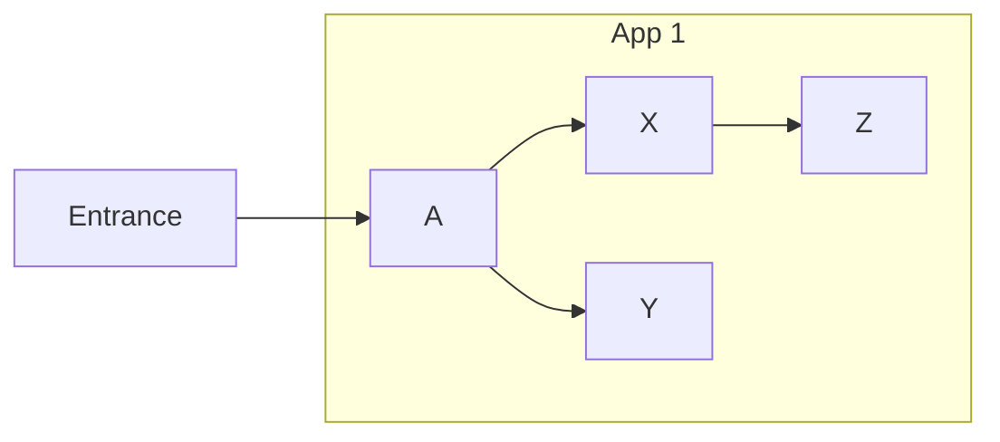
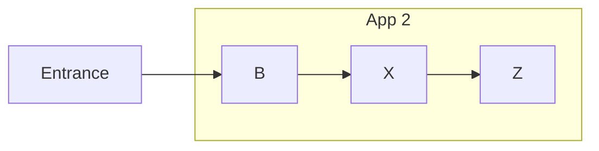
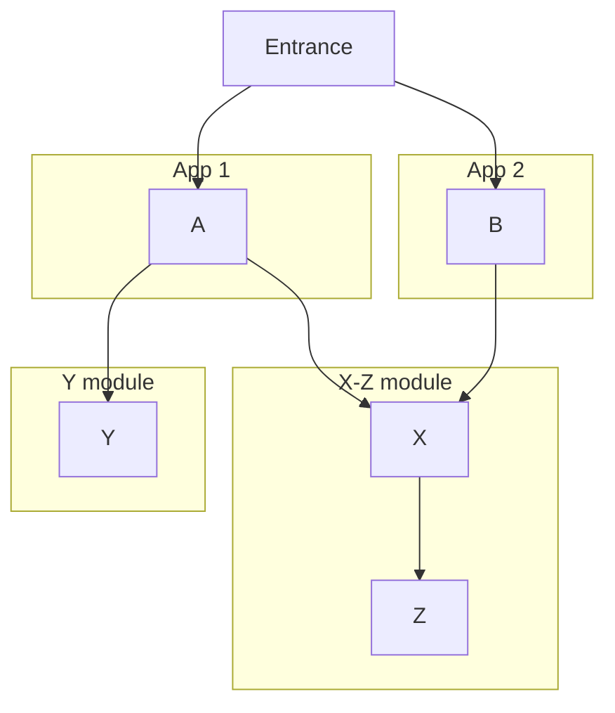
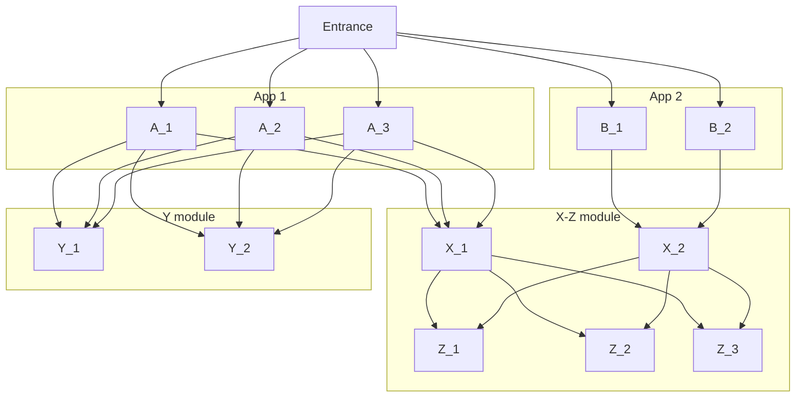
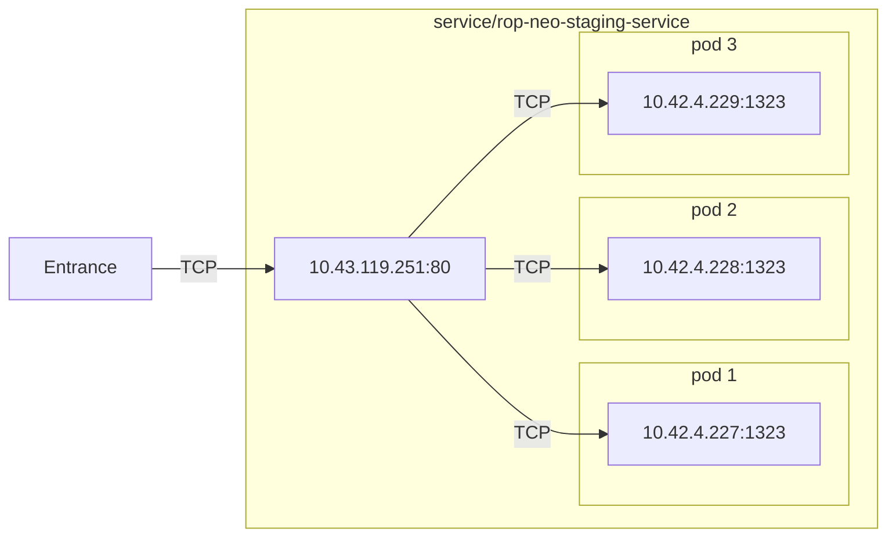
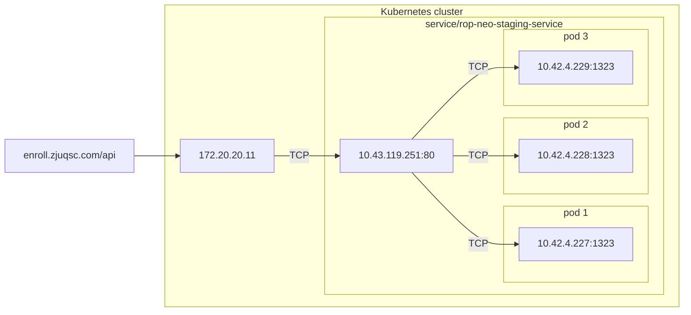
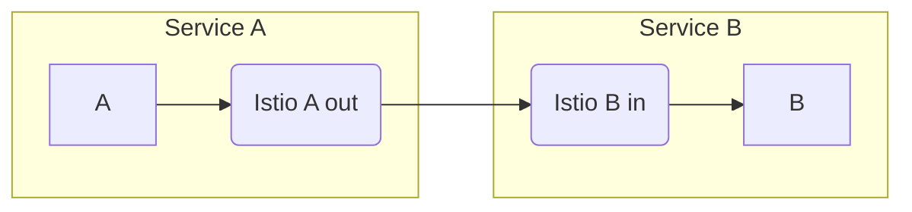
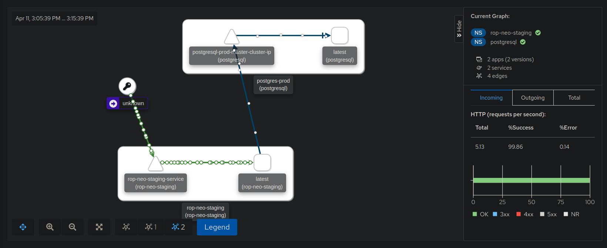
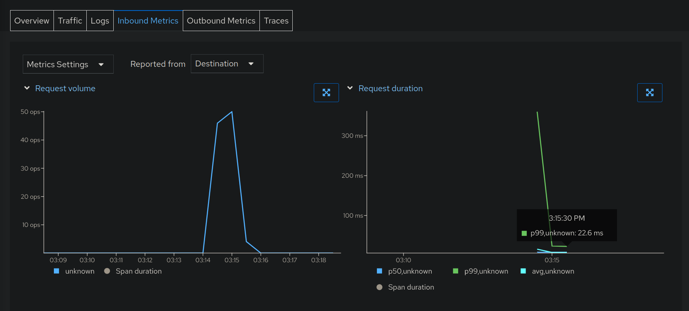
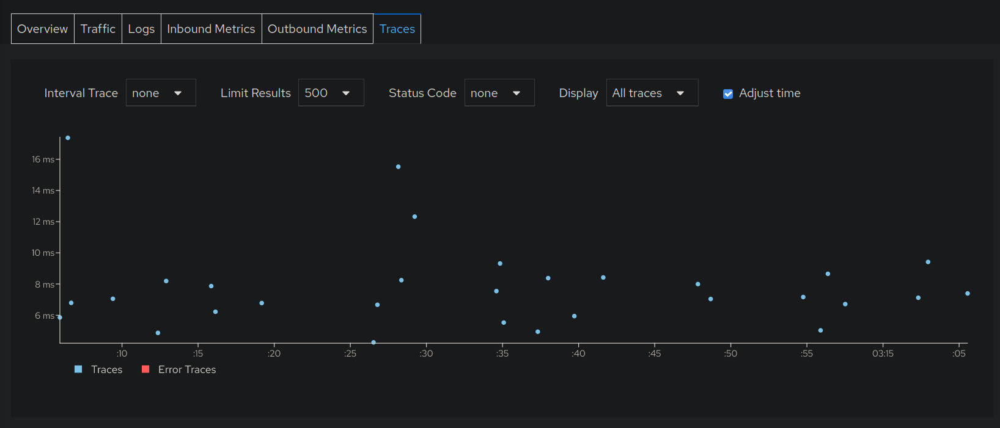

# 计算机网络拓展性实践：基于 Kubernetes 的分布式微服务部署与监测

## 摘要
容器化、微服务是当前互联网行业中的热门词汇。不乏有营销号将其渲染与夸大，以为自己增加流量，但并未触及这些概念的核心。笔者旨在利用 Kubernetes 这一开源系统进行微服务部署与检测的同时，理解微服务网络的构成。  

## 关键词
Kubernetes, 微服务，容器化。  

## 微服务简介

### 传统应用部署

对于一个典型的互联网应用，目前较为流行的方案往往分为前端（浏览器或客户端）和后端（服务端）。前端负责样用户“看”到东西，后端负责给前端提供数据。  
在前后端分离的互联网应用架构中，开发者负责定义服务端的 API ，前端（浏览器或客户端）通过定义好的 API，向服务端发送 HTTP 请求。后端通过对 HTTP 请求(request) 的方法(method)、请求头(head)、请求体(body) 等按 API 的 约定解析，并执行一系列操作，从而实现前端的需求，并将 HTTP 响应(response) 回传给前端。  
对于一个前后端分离的应用而言，传统的服务端应用设计是比较单一的。它往往将所有后端的功能耦合在一起——身份验证服务、数据库校正服务、业务逻辑、以及其他服务的接口调用，全部耦合在同一个程序内。若是代码量只有一千行左右的微型程序，这样做并无很大隐患，但若是代码量达到万行甚至几十万行，如此“巨无霸”的应用带来了相当多的问题。  

### 传统部署带来的问题

1. 若一个程序里耦合了过多功能，当其中一个功能模块出现不可挽回的(fatal) 异常时，往往会导致整个程序的崩溃。这会导致服务下线，给企业造成毁灭性的打击。  
2. 请看如下的依赖关系图：  




由于服务中的组件未被拆分，则在应用 2 中想要复用应用 1 的 X 组件是不现实的。我们不得不将 X 组件连同 X 依赖的 Z 组件全部复制到我们的应用 2 中。一个较为稳定的企业拥有它自己的服务生态系统，使得组件的复用较为频繁。若所谓“复用”仅仅是如此简单的复制粘贴，则重构过程会由于代码的分散而变得异常困难。  

### 微服务的解决方案

微服务的出现，很大程度上解决了上述问题。微服务的思维在于封装与拆分，将一个大型服务，按其中模块的功能拆分出若干个微服务，而一个应用只保留其业务逻辑本身。这样，使得不同应用之间对模块的复用成为可能。  



可以看出，微服务之间互相通讯，形成了一个服务网络。  
在实际生产中，还存在另一种问题：企业往往拥有很多台服务器，而服务端应用往往要为每分钟成千上万的请求服务。为了妥善利用服务资源，在服务网络中，负载均衡 (load balancing) 的重要性便得以体现。


上图的依赖关系看起来非常混乱。然而，通过一些封装与抽象，我们可以使得程序认为它是在像不考虑负载均衡那样通讯（参见不考虑负载均衡的依赖关系图），但实际上，在更底层的抽象层次，我们事实上进行了抽象，使得事实上的依赖关系就像上图这样。这样的好处十分明显：在负载均衡的同时，我们同时也使得，即使一个模块由于种种原因出现了异常（如运行该模块的服务器突然停机），但由于存在其他可替代它的相同模块，则整个服务依然正常运行。  

以上所有“模块”这一用词，只是一个通俗表达。事实上，我们在实践过程中称其为“容器” (container)。由于在微服务语境下，可能有上千个容器运行在上百台服务器上，那么必须有一个足够强大的软件这些容器进行管理：当检测某服务器的资源吃紧时，则把这台服务器上运行的容器自动迁移到另外的服务器上。为了解决这个需求，Kubernetes 出现了。

## Kubernetes 微服务网络的构建

### 初始化

首先，我们应当正确地将 Kubernetes 部署在我们的若干虚拟机上。此部分由于与微服务网络构建的关系不密切，略去不表。  
在部署成功后，创建一个用户，赋予它一些权限，在本机下载 Kubernetes 客户端 `kubectl`，并以这个用户的身份登陆。  
下面是我在完成登陆后， kubectl 的配置：  

```shell
$ kubectl cluster-info     
Kubernetes control plane is running at https://qke.com:6443
CoreDNS is running at https://qke.com:6443/api/v1/namespaces/kube-system/services/kube-dns:dns/proxy
Metrics-server is running at https://qke.com:6443/api/v1/namespaces/kube-system/services/https:metrics-server:/proxy
```

以下命令可以让我们观察当前集群里的所有虚拟机：  
```shell
$ kubectl get nodes
NAME               STATUS   ROLES                       AGE   VERSION
qke-master         Ready    control-plane,etcd,master   1h    v1.20.2+k3s1
qke-worker-181-1   Ready    control-plane,etcd,master   1h    v1.20.2+k3s1
qke-worker-181-2   Ready    control-plane,etcd,master   1h    v1.20.2+k3s1
qke-worker-49-1    Ready    control-plane,etcd,master   1h    v1.20.2+k3s1
qke-worker-49-2    Ready    control-plane,etcd,master   1h    v1.20.2+k3s1
```

不难看出，我们的初始化是成功的。  

### 服务部署

接下来，我们就需要在我们刚刚初始化完毕的集群上，部署我们的应用。这里，我们不妨对一个普通的后端应用进行部署。  
整个部署流程较为繁杂，由于篇幅限制，在此只展示部署结果：  


```shell
$ kubectl get pods -n rop-neo-staging
NAME                                          READY   STATUS    RESTARTS   AGE
rop-neo-staging-deployment-556c59856f-5rjj9   2/2     Running   1          1h
rop-neo-staging-deployment-556c59856f-cclmc   2/2     Running   1          1h
rop-neo-staging-deployment-556c59856f-hll5d   2/2     Running   1          1h
```

我们的后端微服务有三个 pod。正如前面所提到的， Kubernetes 会进行负载均衡，意味着如果 Kubernetes 监测到了当前虚拟机的资源不足，会自动将容器迁移到其他虚拟机。  
那么，接下来，我们来观察其中的一个pod：  

```shell
$ kubectl describe pod/rop-neo-staging-deployment-556c59856f-5rjj9 -n rop-neo-staging
Node:         qke-worker-181-2/172.20.20.52
IP:           10.42.4.229
Controlled By:  ReplicaSet/rop-neo-staging-deployment-556c59856f
Containers:
    Port:           1323/TCP
    Host Port:      0/TCP
    State:          Running
      Started:      Sun, 11 Apr 2021 19:04:48 +0800
```

容易看出，该 pod 运行在 IP地址为 `172.20.20.52` 的虚拟机上，这个 pod 在集群内的 IP地址 为 `10.42.4.229`，且暴露了 `1323` 的端口以与外界建立 `TCP` 连接。  
接下来，让我们来观察一下我们刚刚创建好的 service：  

```shell
$ kubectl describe service/rop-neo-staging-service -n rop-neo-staging
Type:              ClusterIP
IP Families:       <none>
IP:                10.43.119.251
IPs:               10.43.119.251
Port:              http  80/TCP
TargetPort:        1323/TCP
Endpoints:         10.42.4.227:1323,10.42.4.228:1323,10.42.4.229:1323
Session Affinity:  None
Events:            <none>
```

这些信息告诉我们，我们的服务的 IP 在 `10.43.119.251`，暴露的端口为 80，建立 `TCP` 连接。由于我们采用分布式部署，所以该服务的终点pod有三个：`10.42.4.227:1323` , `10.42.4.228:1323` , `10.42.4.229:1323`. 其中，我们在上文中刚刚观察了 IP 为 `10.42.4.229` 的 pod。到现在为止，整个网络的流程图如下：（为了简便起见，pod 的名字被简化）  



尽管我们刚刚暴露了服务的端口，但这个暴露仅仅是面向 Kubernetes 集群内的暴露。我们显然希望，我们的端口能从公网被访问。那么，我们还需要做一个反向代理，将这个集群内的端口暴露到公网。

```shell
$ kubectl describe ingress/rop-neo-staging-backend-ingress -n rop-neo-staging
Name:             rop-neo-staging-backend-ingress
Namespace:        rop-neo-staging
Address:          172.20.20.11
Rules:
  Host                        Path  Backends
  ----                        ----  --------
  enroll.zjuqsc.com  
                              /api   10.43.119.251:80
```

由此，下面的图表展示了从公网访问我们后端服务的完整流程。  



请注意，这只是我们站在“上帝视角”给出的分析。而对于每一层而言，访问都是透明 (transparent) 的。也就是说，当用户访问 `https://enroll.zjuqsc.com/api` 这个 URL 的时候，用户只知道自己访问了 DNS 解析出的公网 IP 地址，而对我们 Kubernetes 集群的使用毫不知情。同理，在 Kubernetes 集群的反向代理过程中，`172.20.20.11` 上的反向代理服务只知道流量去往了 `10.43.119.251:80` 这个服务，而对这个服务的细节不知情。可以看出， Kubernetes 系统为我们建立了非常非常多层次的抽象，以达到隔离、透明的目的；有了“作用域”和多层抽象层次，这使得我们对大型服务的运维变得更加清晰、方便。   

### 服务监测

由于我们的集群内部署了较为大型的服务，且服务与服务之间又有着错综复杂的调用关系，这使得我们不得不探索一种高效的方法，以监测服务的状态和服务间通讯的流量。而 `Istio` 这个工具及与其相关的组件，可以实现我们的需求。  
使用 Istio 进行监测的原理较为简单。当我们正确加入 `Istio` 后，事实上，一个从 A 到 B 的通信变成了这个样子：  



可以看出，当流量从 A 到 B 的过程中，首先经过了 Istio 在 A 端的出口，再经过了 Istio 在 B 端的入口。这个过程对 A，B 二者而言也是透明的，意味着，在双方看来，流量都是直接传响了对方，而没有经过任何其他的服务。这样一来， Istio 服务就可以收集入口和出口的流量信息，从而实现服务监测。  

为了检测服务监测的效果，我们不妨使用开源工具 `ali`， 对刚刚部署的服务进行60秒的拒绝访问 (DoS) 攻击。  
```shell
$ ali https://enroll.zjuqsc.com/api/db -d=60s
```

这是在攻击过程中我们服务的概况。可以看出，我们刚刚部署的服务出现了非常非常多的请求，用箭头上的原点表示。而右边的柱状图告诉我们，在这次攻击过程中，有 99.86% 的 HTTP 请求都得到了 `200 OK` 响应，可见这个服务还是非常稳定的。  



尽管大部分请求都得到了预期内的响应，但我们还是想了解，我们服务的效率如何——即，我们服务的延迟是否过高。那么我们就应该观察另一张图表：  



请看右侧的“响应耗时”图表。青色的线是平均响应耗时，绿色的线表示 “在所有响应中，。99%的响应小于的时长”（一般简称 `p99`）。在全过程中，我们服务的平均响应时长在 20 秒内；而 p99 值最开始很高，但很快下降到了 22.6 ms。可以看出，在这次拒绝访问攻击中，我们的服务依然在高效且稳定地运行。  



这是我们服务响应耗时的散点图。观察此图，可获得与上面的折线图相同的结论。  